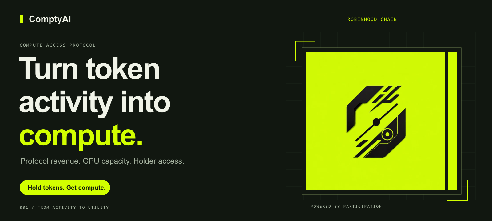
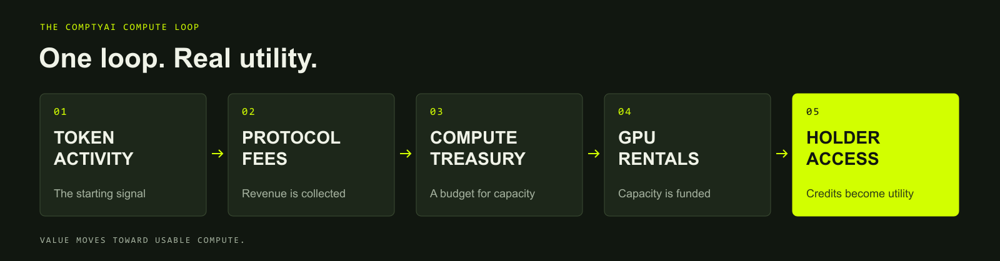
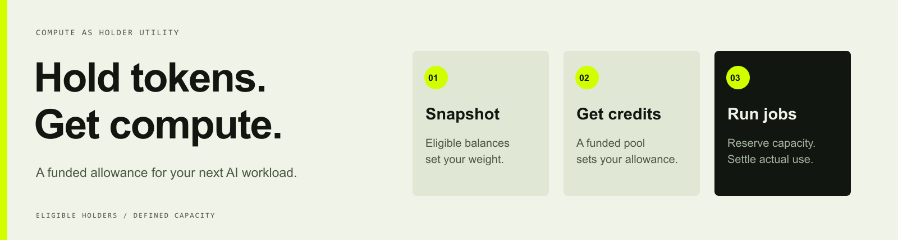
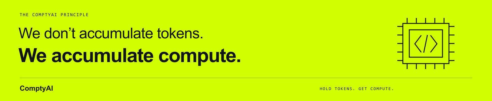

<p align="center">
  
</p>

<p align="center">
  <strong>Hold tokens. Get compute.</strong><br />
  A compute-access protocol designed for Robinhood Chain.
</p>

<p align="center">
  <a href="docs/README.md">Documentation</a> ·
  <a href="docs/protocol/overview.md">Protocol</a> ·
  <a href="docs/developers/quickstart.md">Quickstart</a> ·
  <a href="ROADMAP.md">Roadmap</a>
</p>

<p align="center">
  
  
  
  <a href="LICENSE"></a>
</p>

## The idea

**ComptyAI turns token activity into access to AI compute.** A portion of collected token-related trading fees or protocol revenue is directed to a Compute Treasury. The treasury funds GPU rentals, and eligible token holders receive **Compute Credits** to use that capacity without a separate compute payment within their allocation.

The objective is useful capacity: inference, experiments, agent workloads and, where a supported GPU tier allows it, lightweight training. Token activity helps fund the service; compute is the utility holders receive.

> **“We don’t accumulate tokens. We accumulate compute.”**

**Current stage:** protocol design and a runnable local reference model. Live fee collection, token deployment, funded GPU capacity and wallet-based claims are planned integrations. This repository does not announce a deployed or audited protocol.

## From activity to access



| Step | What happens | What it produces |
| :--- | :--- | :--- |
| **01 · Activity** | Supported token activity generates fees at integrated venues or protocol entry points. | Attributable fee receipts |
| **02 · Fees** | An explicit, configurable share of collected revenue goes to the compute budget. | A reconciled treasury inflow |
| **03 · Treasury** | Funds are reserved for operations and budgeted for available capacity. | An epoch spending limit |
| **04 · Compute** | A provider supplies a defined GPU tier under a rental agreement. | Metered compute capacity |
| **05 · Access** | Eligible holders receive credits, reserve a job and spend credits on usage. | Compute access for holders |

Ordinary token transfers and chain gas fees do not automatically produce revenue for ComptyAI. Fee-generating integrations must be implemented explicitly. Read the [fee-routing design](docs/protocol/fee-routing.md).

## Compute Credits



Compute Credits represent a limited service allowance, not another tradable token. The proposed flow uses an eligible-holder snapshot to allocate an epoch’s funded capacity, then meters use through the compute gateway.

- **Holder access:** eligibility and allocation rules are published for each epoch.
- **Budget-backed allowance:** issued credits must fit the capacity the treasury can fund.
- **Usage accounting:** reserve a maximum, settle actual usage, release the remainder.
- **Defined limits:** each credit has a GPU tier, expiry and service conditions.

“Free compute” means no additional compute charge within a holder’s funded allowance. Capacity, availability and limits still apply; wallet transactions may require network gas. The demo defines **1 credit = 1 minute of one example GPU tier**. Final denominations and allocation policies remain open design decisions.

See [credit lifecycle](docs/protocol/compute-credits.md), [holder eligibility](docs/protocol/holder-eligibility.md) and [allocation math](docs/economics/allocation-model.md).

## Try the reference model

Requires **Node.js 22+**. The example uses only built-in modules, so no dependency installation or wallet is required.

```sh
git clone https://github.com/hazelp343/ComptyAI.git
cd ComptyAI
npm run demo
npm test
npm run check
```

The deterministic demo follows one fictional epoch:

| Example input / output | Value |
| :--- | ---: |
| Collected protocol revenue | $1,000.00 |
| Compute Treasury share · illustrative 60% | $600.00 |
| Treasury reserve · illustrative 10% | $60.00 |
| Compute spending budget | $540.00 |
| Example GPU price | $2.00 / hour |
| Capacity represented by the demo | 270 GPU-hours |
| Allocatable credits | 16,200 |
| Holder weights | 50 / 30 / 20 |
| Holder allocations | 8,100 / 4,860 / 3,240 |

The sample job reserves 120 credits for the first holder, consumes 90 and releases 30, leaving **8,010 available credits**. All values are fictional: they are not live fees, GPU quotes, tokenomics or promised capacity. [Walk through the example →](examples/README.md)

## Repository map

```text
ComptyAI/
├── assets/
│   ├── brand/                   Original project logo + brand notes
│   └── banners/                 Four README banners + editable SVG sources
├── apps/
│   └── console/src/             End-to-end local demonstration
├── packages/
│   ├── compute-core/src/        Budgeting + proportional allocation
│   ├── credit-ledger/src/       Reserve, settle, cancel + expire credits
│   └── chain-config/src/        Robinhood mainnet + testnet metadata
├── services/
│   └── scheduler/src/providers/ Mock GPU adapter + execution flow
├── contracts/
│   └── src/interfaces/          Proposed Solidity integration interfaces
├── configs/                     Explicitly marked example parameters
├── examples/
│   ├── epochs/                  Fee + holder fixture
│   └── jobs/                    Example inference request
├── docs/
│   ├── protocol/                Fees, treasury, credits + eligibility
│   ├── architecture/adr/        Boundaries + design decisions
│   ├── economics/               Budget and allocation formulas
│   ├── developers/              Setup + chain integration notes
│   ├── operations/              Epoch runbook + transparency reporting
│   └── zh-CN/                   Chinese project introduction
├── tests/
│   ├── unit/                    Budget, allocation + ledger invariants
│   └── integration/             Complete mock execution lifecycle
├── scripts/                     Repository validation + asset generation
└── .github/
    ├── workflows/               Repository verification in CI
    └── ISSUE_TEMPLATE/          Bug reports + feature proposals
```

## Designed for Robinhood Chain

The project targets **Robinhood Chain**, an EVM-compatible Ethereum Layer 2 built with Arbitrum technology. The local example defaults to **Robinhood Chain Testnet**; mainnet metadata is provided for future integration. Network IDs and endpoints are documented in [chain configuration](docs/developers/robinhood-chain.md), with links to the [official network documentation](https://docs.robinhood.com/chain/connecting/).

ComptyAI is an independent project. Targeting Robinhood Chain does not imply a partnership or endorsement. No ComptyAI contract address is published in this repository.

## Build status

| Area | Included here | Next milestone |
| :--- | :--- | :--- |
| Identity & documentation | Logo, banners, protocol design, bilingual introduction | Refine with community feedback |
| Compute economics | Integer budget model and exact credit allocation | Finalize policy and real capacity constraints |
| Credit accounting | Tested in-memory reference ledger | Persistent authenticated service |
| GPU execution | Deterministic mock provider | Metered provider integration |
| Onchain layer | Network metadata and proposed interfaces | Implement, test and review contracts |
| Holder experience | Local console walkthrough | Wallet-based access flow |

Read the [roadmap](ROADMAP.md) for milestone acceptance criteria and the [architecture](docs/architecture/system-design.md) for the trust boundaries.

## Build with ComptyAI

Start with the [developer quickstart](docs/developers/quickstart.md), open a focused issue or propose a change through the [contribution guide](CONTRIBUTING.md). See [SECURITY.md](SECURITY.md) for handling sensitive findings.

Code is licensed under [MIT](LICENSE). The project name, supplied logo and brand artwork are covered separately in the [brand notes](assets/brand/README.md).


