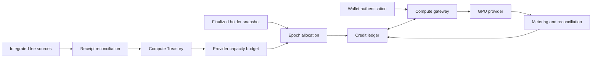

# System design

| Boundary | Responsibility | This repository |
| --- | --- | --- |
| Onchain receipts | Authorize and attribute funds | Proposed interfaces and design notes |
| Snapshot service | Establish eligible account weights | Static example fixtures |
| Allocation engine | Turn a budget into per-holder credits | Implemented local functions |
| Credit ledger | Preserve allowances across job transitions | Implemented in memory |
| Gateway | Authenticate, reserve and dispatch | Synchronous mock flow |
| GPU provider | Execute jobs and report verifiable usage | Mock adapter only |

The treasury and holder snapshot affect the amount of credit issued. The gateway affects who may spend it. The provider and metering process affect the amount consumed. These are separate trust boundaries and should not be represented as a single fully trustless mechanism.

The local model deliberately has no HTTP listener, wallet integration, database or background worker. Its goal is reproducible behavior for the economics and credit state machine.
